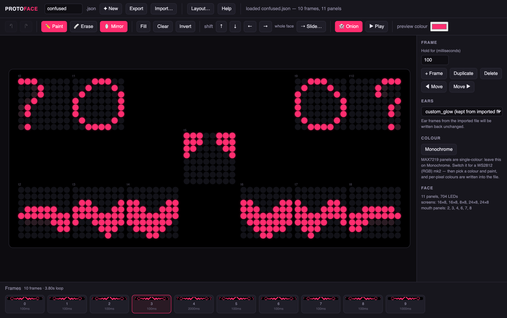

# Protoface

An animation editor for protogen helmets running
[NCPlyn's ProtoESP firmware](https://github.com/NCPlyn/ProtogenHelmet-ESP32).

Open `protoface.html` in a browser. That's the entire install — one file, no
build step, no dependencies, no internet. It runs off a USB stick, and you can
hand it to someone who doesn't code.



> **Not yet tested on hardware.** The file format is verified against the
> firmware source, and every stock animation round-trips through the editor
> bit-for-bit (98 automated tests). But nobody has yet put a face made here onto
> a real helmet. If you do, please open an issue and say how it went.

## What it's for

ProtoESP already ships an animator, and it's good — it's in the firmware repo at
`ProtoESP-Controller/data/animator.html`, and the helmet serves its own copy
over WiFi. Protoface isn't a replacement. It's built around the parts that get
painful once you're making things that *move* rather than single faces:

|                              | Protoface | ProtoESP's animator |
|------------------------------|-----------|---------------------|
| Mirror                       | live, while you draw | button, applied afterward |
| Onion skin                   | yes       | no |
| Undo / redo                  | 80 steps  | no |
| Frame timeline               | thumbnails, drag to reorder | numbered list |
| Motion tween (Slide)         | yes       | no |
| Playback                     | at real per-frame timings | yes |
| Rotate / flip a panel        | no        | yes |
| Toggle a whole row or column | no        | yes |
| Copy-paste between panels    | no        | yes |
| **Ear animations**           | no — passed through untouched | yes, full editor |
| Runs on the helmet over WiFi | no        | **yes** |

Files move freely between the two — same format, no conversion. A reasonable
workflow is to draw faces here and use theirs for ears and for live tweaks with
the head on.

## Words

| Word | Meaning |
|---|---|
| **panel** (*matrix*, *segment*) | One 8×8 square of LEDs. A helmet is several, chained. |
| **t0, t1, t2…** | Panel numbers, in the order they're wired — not their position on the face. |
| **frame** | One picture of the whole face, plus how long it stays up. |
| **timespan** | How long a frame is held, in milliseconds. 1000 = one second. |
| **layout** | Which panel sits where. Written as a `visType` string. |
| **mirror** | Draw one half of the face, the other half follows. |
| **onion skin** | The previous frame shown faintly behind the current one. |
| **MAX7219** | The single-colour panels. Every LED is just on or off. |
| **WS2812** | The colour panels. Every LED can be any colour. |
| **isMouth** | Which panels count as "mouth" — the firmware wobbles these with the mic. |

## Drawing

1. **Draw** by clicking and dragging. Mirror is on, so the other half follows.
2. **Duplicate** the frame, move things slightly. That's animation.
3. **Onion** ghosts the previous frame behind you so you can see how far
   things moved.
4. **Hold for** sets how long the frame stays up. 100ms is quick, 600ms is a
   slow blink.
5. **Play** loops it. Drag frames along the bottom strip to reorder.
6. **Export** gives you a `.json` the firmware reads directly.

**Import** opens any existing animation, including the stock ones, so you can
start from `happy.json` rather than a blank face.

Two behaviours that stay out of your way:

- **Changing anything stops playback.** Otherwise the playhead keeps advancing
  while you type a duration, and the number smears across several frames.
- **Undo goes back 80 steps** (`⌘Z` / `Ctrl+Z`). A whole drag is one step, and
  so is a whole number typed into a box — undo rewinds a *gesture*, not a
  keystroke. It clears when you import a file or change the panel count, since
  those make earlier steps the wrong shape to restore.

Keys: `⌘Z` undo · `⇧⌘Z` redo · `Space` play · `←` `→` frames · `D` duplicate ·
`E` eraser · `M` mirror · `O` onion · `Backspace` delete frame.

## Slide

Draw a pattern once, then **Slide…** generates the frames that carry it across
the face. Set how far it travels and how many frames it takes.

**Wrap around** is the useful part: pixels leaving one edge come back on the
other, so a scroll loops. Slide by exactly the width of a screen and it closes
seamlessly — the frame that would repeat your first one is dropped
automatically.

Slide moves each *band* of panels independently: on a normal face the two mouth
halves scroll as separate 24-pixel strips rather than one 48-pixel one, so
nothing leaps across the middle of the face. Click a panel's small `t` label
first to slide only that panel.

## Getting it onto the helmet

Either:

- **Over WiFi** — join the helmet's network (`ProtoWiFi` / `Proto1234` by
  default), open the page it serves, upload the file.
- **Over USB** — drop the `.json` into `ProtoESP-Controller/data/anims/` and
  upload the filesystem image with PlatformIO.

To make an animation fire on a boop or a head tilt, point `aBoop` / `aTilt` /
`aUp` in `data/config.json` at its filename.

There's a CRC checksum on the data partition (`configCRC.txt`) that looks like
it might reject files you add. It doesn't — it covers `config.json` only
(`genCRC-auto.py`, `fileOp.cpp:142-147`). Animations aren't checksummed.

## Match the layout to your helmet

Protoface defaults to an 11-panel face:

| Panels | Part | Size |
|---|---|---|
| t0, t1 | eye | 16×8 |
| t2, t3, t4 | mouth | 24×8 |
| t5 | nose | 8×8 |
| t6, t7, t8 | mouth | 24×8 |
| t9, t10 | eye | 16×8 |

The **wiring order** above is certain — it's what every stock animation uses.
Where those panels physically sit is a guess, mirroring the arrangement the
ProtoESP repo ships. **Read `data/visType.txt` off your own helmet and paste it
into Layout…**, otherwise you may be drawing on the wrong squares.

A layout string is cells separated by `;` — `t4` is a panel, `blush2` is a
blush LED pair, `-` is a gap, `_` starts a new row:

```
t0;t1;-;-;-;-;-;t9;t10;_;-;-;-;-;t5;-;-;-;-;_;t2;t3;t4;-;-;-;t6;t7;t8
```

Two things worth knowing:

- The firmware repo is internally inconsistent — `src/main.cpp` sets
  `MATRIXESNUM 11` while the shipped `data/visType.txt` describes a **14**-panel
  face. Whatever is flashed on your helmet wins. Both are presets here.
- `main.cpp` notes that the visor data line starts at the **right cheek**, so
  `t0` may be on the wearer's right. It makes no difference to a symmetric face;
  it does to a wink. If your first asymmetric animation comes out backwards,
  that's why.

## Colour

Leave it on **Monochrome** for MAX7219 panels — the file gets `fColor` and
`ppColor` full of zeros and the helmet uses `visColor` from its own config.

For WS2812 panels, switch to **RGB**. The colour you paint with is written
per-pixel into `ppColor`, and **Colour selected panel** sets a whole panel's
`fColor`. The firmware's order of preference is per-pixel, then per-panel, then
the config default.

## Ears

Protoface doesn't draw ear animations. Pick one of the firmware's built-in types
(`rainbow`, `white_noise`, `corner_sabers`, `none`). If you import a file with
hand-made ear frames, they're written back out untouched — editing a face never
destroys someone's ear work.

## The format

Verified against `ProtoESP-Controller/src/main.cpp`.

```jsonc
{
  "ears":  { "type": "rainbow" },
  "visor": {
    "type": "custom",
    "isMouth": [false,false,true,true,true,false,true,true,true,false,false],
    "frames": [{
      "timespan": 600,                       // ms this frame is held
      "fColor":  ["0","0", ...],             // per-panel colour, "0" = none
      "ppColor": [{ "mIndex": 3,             // per-pixel colour, panel 3
                    "data": [[9,"00ff88"]] }],   //   [pixel index, rrggbb]
      "leds":    ["000c1c3870e0c080", ...],  // one 64-bit hex string per panel
      "ledsBlush": ["0","0", ...]            // the LEDs under the eyes
    }]
  }
}
```

Each `leds` string is a panel's 64 pixels as a big-endian 64-bit number:

```
bit index = row * 8 + col        row 0 = top, col 0 = left
```

so the **leftmost** hex pair is the bottom row and the **rightmost** is the top.
From `main.cpp:782-804`:

```c
byte row = (leds[y] >> i*8) & 0xFF;        // i = row
mx.setPoint(i, j + y*8, bitRead(row, j));  // j = col
```

Mirroring is panel `p ↔ N-1-p`, column `c ↔ 7-c`, same row.

## Tests

```
npm i -D playwright && npx playwright install chromium
node test.mjs
```

Boots the page in headless Chromium, imports all eight stock animations,
re-exports them, and asserts every panel of every frame is bit-identical — then
checks mirroring, sliding, band shifting, undo granularity, layout validation,
RGB round-tripping, timeline reordering and the download.

## Licence

Protoface is **MIT** — see [LICENSE](LICENSE).

The sample animations in `fixtures/anims/` are *not*. They're unmodified files
from the ProtoESP repo, © NCPlyn, GPL-3.0. See
[fixtures/README.md](fixtures/README.md); delete the folder and pass the tests a
path to your own firmware checkout if you'd rather not have them.

## Credit

The firmware, the format, and the original animator are NCPlyn's work:
[ProtogenHelmet-ESP32](https://github.com/NCPlyn/ProtogenHelmet-ESP32). Protoface
only writes files their firmware reads; none of this exists without it.

If you're building a protogen on their work, consider
[sending them something](https://revolut.me/ncplyn). They ask, and it's fair.
